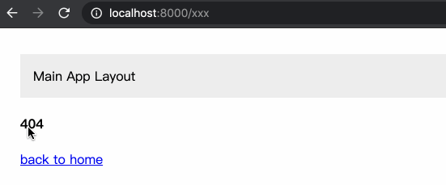

# dingpa（钉耙）

[](https://www.npmjs.com/package/dingpa)[](https://www.npmjs.com/package/dingpa)

快速理解微前端原理。

## 🎉 Features

- [x] 零依赖
- [x] 快照沙箱
- [x] script（js） 与 link（css） 资源加载

## 🍙 Examples



## 🚀 Getting started

[参考示例](./examples)

## 📦 Installation

```sh
yarn add dingpa       // 主应用安装
yarn add @dingpa/app  // 子应用安装
```

## 🔗 Related

- [qiankun](https://github.com/umijs/qiankun)
- [icestark](https://github.com/ice-lab/icestark)
    
## 👓 Flow


**[⬆ Back to Top](#)**